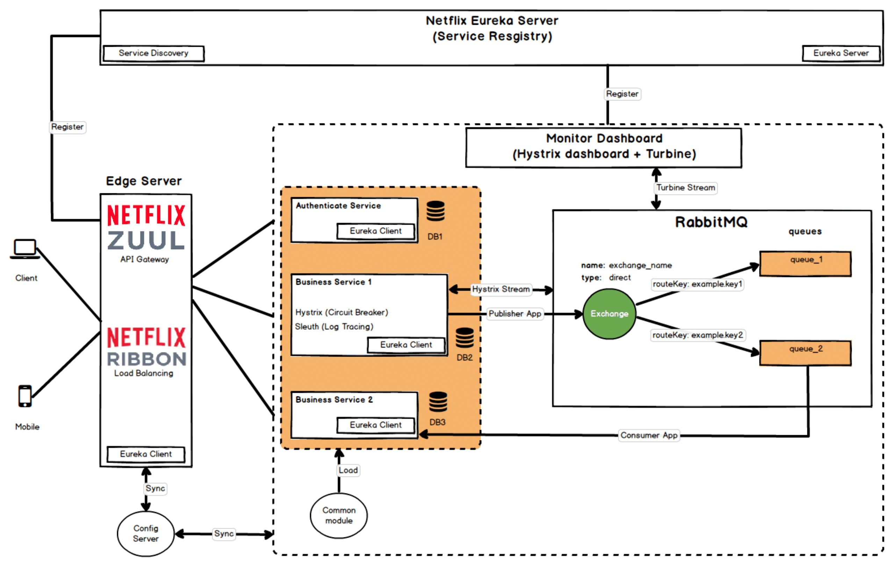
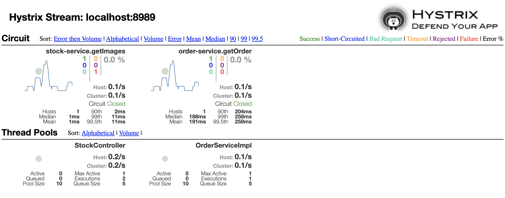

# Building microservice using Spring Boot and Eureka

- [Netflix OSS framework](#netflix-oss-framework)
  - [Overview](#overview)
  - [Architecture](#architecture)
  - [Demo](#demo)

## Netflix OSS framework

### Overview

- **Service Discovery:** Netflix Eureka
- **Circuit Breaker:** Netflix Hystrix
- **Gatekeeper:** Netflix Zuul
- **Intelligent Routing, Load Balancing:** Netflix Ribbon
- **Monitoring:** Netflix Hystrix Dashboard and Netflix Turbine
- **Log Tracing:** Sleuth, Zipkin
- **Centralized Configuration:** Spring Cloud Config Server
- **Distributed Messaging System:** Apache Kafka

### Architecture

### Demo
1. `mvn clean install -DskipTests=true` at **common** module before running other applications
2. `cd docker/kafka && docker-compose up -d` to start kafka cluster
3.  [Postman data](readme/spring-microservices.postman_collection.json)
- Kafka Brokers: localhost:19092, localhost:29092, localhost:39092
- Eureka Server: http://localhost:8761 (service registry & service discovery)
- Gateway Zuul: http://localhost:8762
- Authenticate: http://localhost:8762/auth (admin/12345)
- Order service: http://localhost:8762/order?id=1&isFallBack=false (isFallBack=true will perform fall back method)
- Hystrix Dashboard: http://localhost:9898/hystrix
- Turbine Stream: http://localhost:8989 (used by ******Hystrix Dashboard** to monitor stream)
