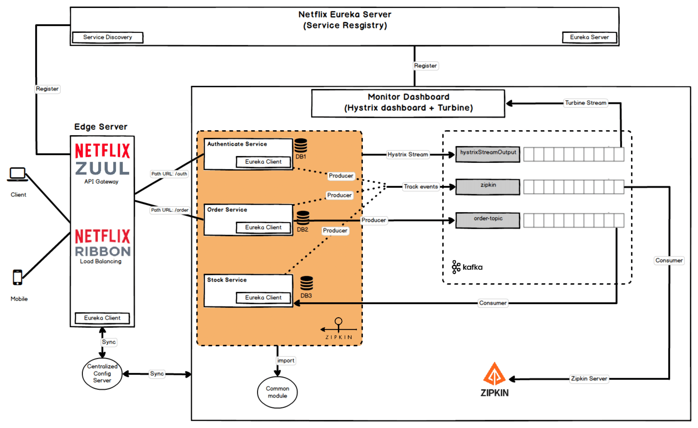

# Building microservice using Spring Boot and Eureka

- [Netflix OSS framework](#netflix-oss-framework)
  - [Overview](#overview)
  - [Architecture](#architecture)
- [Build And Run](#build-and-run)
  - [Build](#build)
  - [Demo](#demo)

## Netflix OSS framework

### Overview


- **Service Discovery:** Netflix Eureka
- **Circuit Breaker:** Netflix Hystrix
- **Gatekeeper:** Netflix Zuul
- **Intelligent Routing, Load Balancing:** Netflix Ribbon
- **Monitoring:** Netflix Hystrix Dashboard and Netflix Turbine
- **Log Tracing:** Sleuth, Zipkin
- **Centralized Configuration:** Spring Cloud Config Server
- **Distributed Messaging System:** Apache Kafka

### Architecture


## Build And Run
### Build
- `make docker/kafka/up` to start kafka cluster
- `make setup` to build shared **POM** and **common** module (it's necessary to run other services)
  - using **IntelliJ IDEA** file -> open -> select **spring-microservices** folder
  - Start `config-server -> eureka-server -> gateway-zuul` firstly and then other services
- `make build` to build and install shared dependencies
   
- [Postman data](readme/spring-microservices.postman_collection.json)

### Demo
- **Kafka Brokers**: localhost:19092, localhost:29092, localhost:39092
- **Config Server**: http://localhost:8888/service-name/service-name.properties
  >http://localhost:8888/order-service/order-service.properties will get all properties of order-service
  ```bash
    username: nguyenvm
    password: nguyenvm@123
  ```
- **Eureka Server**: http://localhost:8761 (service registry & service discovery)
- **Gateway Zuul**: http://localhost:8762
- **Authenticate**: http://localhost:8762/auth
  ```bash
    username: admin
    password: 12345
  ```
- **Order service**: http://localhost:8762/order?id=1&isFallBack=false (isFallBack=true will perform fall back method)
- **Hystrix Dashboard**: http://localhost:9898/hystrix
- **Turbine Stream**: http://localhost:8989 (used by **Hystrix Dashboard** to monitor stream)
#### Hystrix Dashboard

#### Eureka Server
