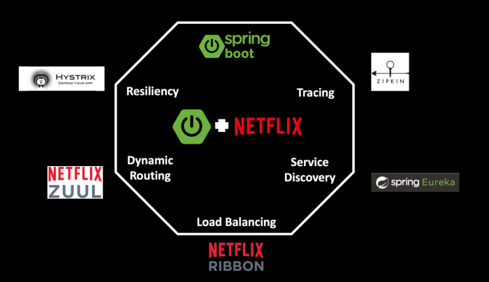
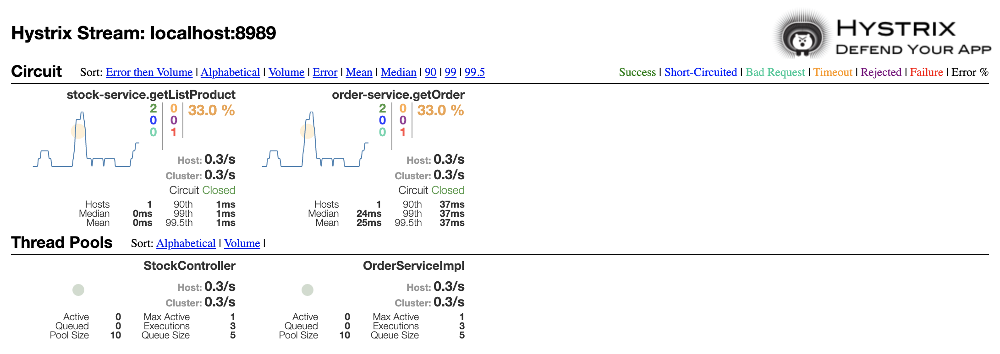

# Building microservice using Spring Boot and Spring Cloud Netflix

- [Netflix OSS framework](#netflix-oss-framework)
  - [Overview](#overview)
  - [Architecture](#architecture)
- [Build And Run](#build-and-run)
  - [Build](#build)
  - [Demo](#demo)

## Netflix OSS framework

### Overview


- **Service Discovery:** Netflix Eureka
- **Circuit Breaker:** Netflix Hystrix
- **Gatekeeper:** Netflix Zuul
- **Intelligent Routing, Load Balancing:** Netflix Ribbon
- **Monitoring:** Netflix Hystrix Dashboard and Netflix Turbine
- **Services Tracing:** Sleuth, Zipkin
- **Centralized Configuration:** Spring Cloud Config Server
- **Distributed Messaging System:** Apache Kafka

### Architecture


## Build And Run
### Build
1. `make setup/all` to setup maven and build jar for the whole project
   
2. `make docker/all/up` to build and start all project
3. `make docker/all/stop` to stop all project
- [Postman data](docs/spring-microservices.postman_collection.json)

### Demo
#### URL:
1. **Kafka Brokers**: localhost:19092, localhost:29092, localhost:39092
2. **Centralized Config Server**: http://localhost:8888/service-name/service-name.properties
  >For example: http://localhost:8888/order-service/order-service.properties will get all properties of order-service
  ```bash
    username: nguyenvm
    password: nguyenvm@123
  ```
3. **Eureka Server**: http://localhost:8761 (service registry & service discovery)
4. **Gateway Zuul**: http://localhost:8762
5. **Authenticate**: http://localhost:8762/auth
  ```bash
    username: admin
    password: 12345
  ```
6. **Order Service**: http://localhost:8762/order?id=1&isFallBack=false (isFallBack=true will perform fall back method)
7. **Hystrix Dashboard**: http://localhost:9898/hystrix
8. **Turbine Stream**: http://localhost:8989 (Stream Aggregator is used by **Hystrix Dashboard** to monitor stream)
9. **Tracing Services**: http://localhost:9411/zipkin

#### Hystrix Dashboard:

#### Eureka Server:


#### Tracking Services With Zipkin:


